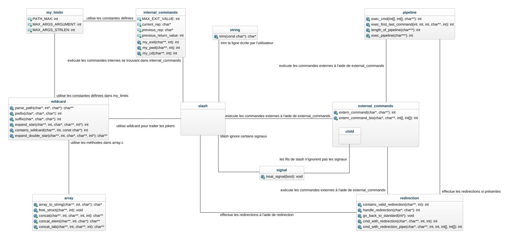

# Architecture

## Diagramme des classes

Un diagramme montrant les différentes relations entre les classes a été crée pour mieux visualiser ce projet.



Lors de son lancement, `slash` ignore `SIGINT` et `SIGTERM`, affiche son prompt et attend une ligne de commande de l'utilisateur. Selon le contenu de cette ligne de commande, `slash` va effectuer plusieurs actions :
- si la ligne contient un joker (`*` ou `**`), alors `slash` va la traiter et la remplacer par des noms de fichiers à l'aide des méthodes contenu dans `wildcard.c`
- si la ligne contient un pipeline alors `slash` va la traiter à l'aide des méthodes contenus dans `pipeline.c`, qui permettent d'exécuter toutes les commandes des pipes avec des redirections en plus
- si la ligne contient seulement une commande redirigé, alors `slash` va l'exécuter à l'aide des méthodes de `redirection.c`, qui permettent de rediriger l'entrée standard, la sortie standard ou la sortie erreur
- si la ligne contient seulement une commande interne, alors `slash` va l'exécuter à l'aide de `internal_commands.c`
- enfin, si la ligne conteint uniquement une commande externe, alors `slash` va l'exécuter à l'aide de `external_commands.c`

## Détails des structures de données implémentées

Le programme `slash` utilise uniquement des structures de données de la librairie standard.

## Détails des algorithmes implémentés

### Commandes internes
- Commande `exit`

La fonction `exit` prend en argument un tableau d'argument et sa taille, et quitte le programme `slash` avec une valeur de retour. Cette valeur de retour est soit celle de l'argument donné, soit celle de la dernière fonction appelé si aucun argument n'a été donné.

Les différentes étapes de la fonction `exit` sont détaillées ci-dessous :
```
Entrée : un tableau contenant les arguments de la commande et sa taille
Sortie : 0 si la fermeture s'est bien passé, un autre chiffre sinon
Fonction exit :
    vérification des arguments donnés : si plus d'un argument a été donné alors affiche une erreur
    si aucun argument n'a été donné alors
        quitte le programme avec la valeur de retour de la dernière fonction appelée
    sinon
        vérifie si l'argument donné est un nombre inférieur ou égal à la plus grande valeur d'exit possible : si ce n'est pas le cas alors affiche une erreur
        quitte le programme avec la valeur de retour donnée
```

- Commande `pwd`

La fonction `pwd` prend en argument un tableau d'argument et sa taille, affiche le chemin du répertoire courant, et retourne si la fonction s'est exécuté correctement. Les seuls arguments autorisés sont `-P` et `-L`. Dans le cas où une suite d'option `-P` et `-L` est donné, seule la dernière option est considéré.

Les différentes étapes de la fonction `pwd` sont détaillées ci-dessous :
```
Entrée : un tableau contenant les arguments de la commande et sa taille
Sortie : 0 si l'affichage s'est bien passé, un autre chiffre sinon
Fonction pwd :
    vérification des arguments données : si un argument n'est pas -P ou -L alors affiche une erreur
    si l'option est -P alors
        affiche le chemin interprété de manière physique
    sinon
        affiche le chemin stocké
```

- Commande `cd`

La fonction `cd` prend en argument un tableau d'argument et sa taille, change le répertoire courant et retourne si le changement de répertoire s'est bien effectué. Les seuls arguments autorisés sont `-P`, `-L`, `-`, et un chemin valide. Dans le cas où une suite d'option `-P` et `-L` est donné, seule la dernière option est considéré.

Les différentes étapes de la fonction `cd` sont détaillées ci-dessous :
```
Entrée : un tableau contenant les arguments de la commande et sa taille
Sortie : 0 si le changement de répertoire s'est bien passé, un autre chiffre sinon
Fonction cd :
    vérification des arguments donnés : si plus d'un argument qui n'est pas -, -P, -L est trouvé alors affiche une erreur

    si aucun chemin n'a été donné alors
        récupère le contenu de la variable environnementale $HOME
    si - a été donné en argument alors
        récupère le chemin du précédent répertoire courant
    si le chemin doit être interprété de manière logique alors
        si le chemin n'est pas un chemin absolu alors
            concatène le chemin du répertoire courant au chemin donné
        si le chemin contient . ou .. alors
            retire . et .. du chemin en respectant l'interprétation

    changement de répertoire dans le chemin récupéré/traité
    si le changement de répertoire ne s'est pas effectué et que le chemin était interprété de manière logique alors
        changement de répertoire dans le chemin non traité
    
    si le changement de répertoire a été fait avec une interprétation physique alors
        stocke le chemin interprété de manière physique
    sinon
        stocke le chemin traité
```

### Gestion des commandes externes
Les commandes externes à `slash` sont exécutées dans un processus fils, à l'aide de la famille de commande `exec`.

Une explication globale de la fonction exécutant les commandes externes est détaillée ci-dessous :
```
Entrée : cmd (le nom de la commande), arguments (un tableau contenant le nom de la commande et ses arguments)
Sortie : la valeur de retour de la commande exécutée
Fonction extern_command : 
    crée un fils
    si c'est le fils alors
        restaure la gestion des signaux par défaut
        exécute la commande
    sinon
        attend le fils
        récupère sa valeur de retour
```

### Gestion des jokers
Le programme `slash` permet l'expansion de deux jokers : `*` et `**/`.

Le joker `*` permet de prendre tous les fichiers respectant le motif donné. Pour ce faire, une fonction `expand_star` a été écrite, qui cherche tous les fichiers correspondant au motif et renvoie un tableau contenant toutes les expansions.

Une explication globale de la fonction permettant l'expansion du joker `*` est détaillée ci-dessous :
```c
Entrée : path (le chemin à expandre), length (le nombre de fichier contenu dans le chemin), current_path (le chemin du répertoire courant)
Sortie : un tableau contenant tous les chemins étendus
Fonction expand_star (path, length, current_path) :  
    si path ne contient pas de joker alors
        retourne path
    si path ne contient qu'un seul fichier alors
        cherche toutes les options dans current_rep qui correspondent au motif
        concatène toutes les options trouvées avec current_rep
        retourne toutes les options concaténées
    sinon // path contient un répertoire (A/*B/*.c)
        tant que path contient plus de deux fichiers (un fichier et un répertoire)
            si le répertoire contient le joker alors
                cherche tous les répertoires du répertoire courant qui correspondent au motif
            sinon
                cherche toutes les options du répertoire courant qui correspondent au motif
                pour chaque option trouvé faire
                    concatène l'option trouvé avec current_path
                    supprime le fichier de path
                    rappelle la méthode en avançant path et current_rep
```

Le joker `**/` permet quant à lui de prendre tous les chemins physiques ayant comme suffixe ce qu'il se trouve après le joker. L'implémentation de cette méthode, `expand_double_star`, est ainsi similaire à celle de `expand_star`.

Une explication globale de la fonction permettant l'expansion du joker `**/` est détaillée ci-dessous :
```
Entrée : path (le chemin à expandre sans le joker), length (le nombre de fichier dans path), current_path (le chemin du répertoire)
Sortie : un tableau contenant tous les chemins étendus
Fonction expand_double_star (path, length, current_path) :
    si path contient seulement le joker alors
        renvoie toute l'arborescence du répertoire courant
    sinon
        cherche toutes les options du répertoire courant
        pour chaque option respectant le motif faire
            concatène l'option trouvé avec current_path
        rappelle la méthode en avançant dans path et current_path
```

### Gestion des redirections

Le programme `slash` permet de rediriger l'entrée standard, la sortie standard et la sortie erreur des différentes commandes éxécutées. Pour celà, on teste si la ligne de commande contient une redirection, et si oui on l'effectue.

Une explication globale de la fonction permettant les redirections est détaillée ci-dessous :
```
Entrée : arguments (un tableau contenant tous les arguments de la commande)
Sortie : 0 si la redirection s'est effectuée, un autre chiffre sinon
Fonction redirection (arguments) :
    tant que arguments contient des redirections faire
        récupère le symbole de redirection
        récupère le fichier d'origine/destination 
        si ce qui suit après ou avant la redirection n'est pas valide alors
            renvoie une erreur
        sinon
            effectue la redirection
```

Après la commande exécutée, les redirections sont remises à défaut.

### Gestion des pipelines
Deux commandes reliés par des pipelines ont leur comportement légèrement modifiés : la première commande envoie son résultat à la deuxième commande qui s'en sert comme entrée. Il est possible de rediriger l'entrée standard pour la première commande, de rediriger la sortie standard pour la dernière commande et de rediriger la sortie standard pour chaque commande.

Une explication globale des fonctions permettant les redirections est détaillée ci-dessous :
```
Entrée : un tableau de tableau de string, séparés selon les pipes (ls -l | wc -l devient [["ls", "-l"], ["wc", "-l"]])
Sortie : la valeur de retour de la dernière fonction exécuté
Fonction pipeline :
    si la première commande contient des redirections valides alors
        effectue les redirections
    exécute la commande et récupère le résultat dans un pipe
    pour chaque commande entre la première et la dernière faire
        si la commande contient une redirection valide alors
            effectue la redirection
        exécute la commande en prenant comme entrée le précédent pipe et en récupérant le résultat dans un nouveau pipe
    si la dernière commande contient une redirection valide alors
        effectue la redirection
    exécute la commande en prenant comme entrée le précédent pipe
    retourne la valeur de retour de la commande exécutée
```

### Gestion des signaux
Le programme `slash` ignore les signaux `SIGINT` et `SIGTERM`, contrairement à ses fils. Pour ce faire, une fonction `treat_signal(bool)` a été écrite, qui ignore ou non les deux signaux selon le boolean donné.

```
Entrée : un boolean
Fonction treat_signal :
    si le boolean est à vrai alors
        ignore les deux signaux
    sinon
        restaure le comportement par défaut des deux signaux
```

Il suffit ainsi d'appeler cette méthode à l'initialisation du programme `slash` pour le faire ignorer ces signaux, et à l'initialisation de ses fils pour qu'ils ne les ignorent pas.